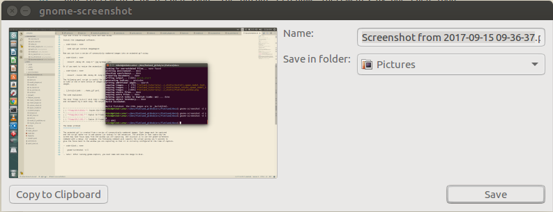
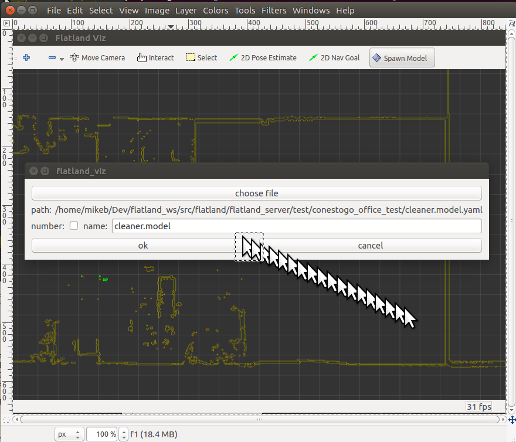

.. image:: ../_static/flatland_logo2.png
    :width: 250px
    :align: right
    :target: ../_static/flatland_logo2.png

Doccumentation
==============

This section describes how these readTheDocs documents were created.

Build 
=====

The readTheDocs documents are built using the Sphinx software from here linkToSphinx_.

.. _linkToSphinx: http://sphinxsearch.com/downloads

To build the software go to the docs directory and type:

.. code-block:: none

    make clean
    make html

.. note:: The make clean is only required when rebuilding the TOC.

Animated Content
================

This documentation uses animated gifs to enhance the content. There are some
tips and tricks to creating these decribed below.

To create animiated gif, install the imagemagik software:

.. code-block:: none

    sudo apt-get install imagemagick

Now you can turn a series of consecutivly numbered images into an animated gif using:

.. code-block:: none

    convert -delay 20 -loop 0 *.jpg myimage.gifs

Or if you want to resize the animation:

.. code-block:: none

    convert -resize 20% -delay 20 -loop 0 *.jpg myimage.gif

The following perl script is useful for creating nice animated gifs. Its purpose is
to take in one or more series of images and add one or more pause(s) by duplicating selected
images.

.. literalinclude:: ../make_gif.perl

The code explained:

The line 'fcopy (a,b,c)' will copy c image files. The input file name starts from image a
and increments by b each loop. The output filename increments by one each loop. 

+----------------------------------------------------------------------------------------------------+
| | **fcopy(10,0,$ld);**: Copies $ld frames using only frame ee10.png                                |
+----------------------------------------------------------------------------------------------------+
| | **fcopy(10,1,10);**: Copies 10 frames starting from ee10.png incrementing input by 1 each time   |
+----------------------------------------------------------------------------------------------------+
| | **fcopy(10,-1,10);**: Copies 10 frames starting from ee10.png decrementing input by 1 each time  |
+----------------------------------------------------------------------------------------------------+

The modal problem
=================

The animated gif is created from a series of consecutively numbered images. Each image must be captured
and the script above run to add pauses (ie timing) to the animation. The problem is that capturing the 
screen may take focus away from the window you are capturing. One solution is to use the gnome-screenshot
command with a delay. For example, the following command will caputre the screen giving you 5 seconds to
give the focus back to the window you are capturing so that it is correctly configured at the time of capture.  

.. code-block:: none
    
    gnome-screenshot -d 5

.. note:: After running gnome-capture, you must name and save the image to disk.

The cursor problem
==================

One issue when making a video of a GUI interaction is that capturing the screen ignores the cursor.
Also the window that is captured is usually shown at a size that is smaller than the original. Imagine 
a window shown at half of the original size. Even if you could capture the cursor, it would be too
small to see. The solution is to add your own oversized cursor and animate it.

Ubuntu cursor graphics are availble, including a double size cursor, look in:

.. code-block:: none

    /usr/share/icons/DMZ White/cursors/arrow

.. note:: To import this file into gimp set the input file type to all files.

The following image shows a gimp layered image with 20 arrows in different locations
(on different layers). The arrows were made visible, one at a time, and an individual 
image file was saved for each frame of animation.

